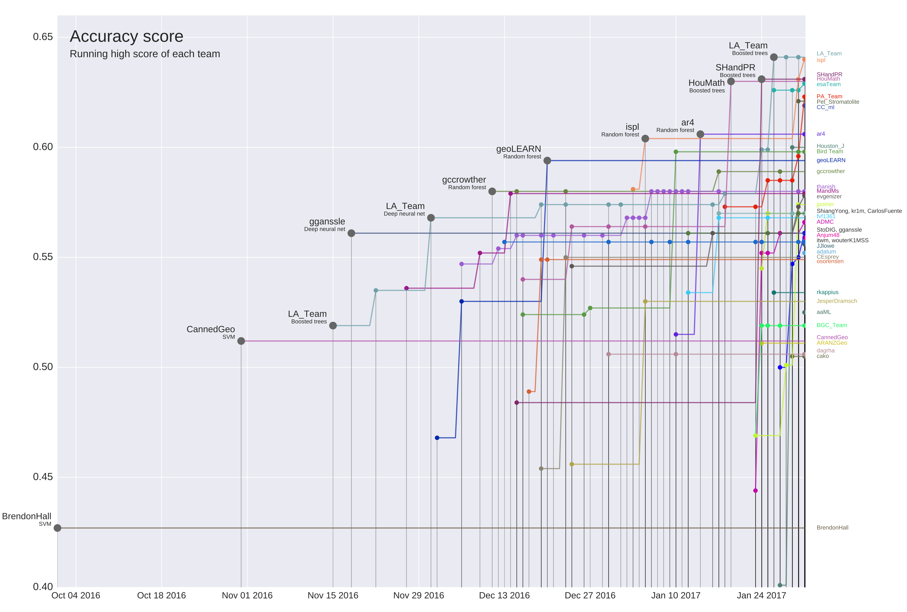

title: A little data goes a long way - A look back at the SEG machine learning contest
slug: machine-learning-contest-lookback
category: article
tags: open data, geoscience, machine learning, data science
date: 2019-08-8
modified: 2019-08-08

A thousand metres beneath the earth’s surface in the southwest corner of Kansas, lies the Permian-aged Panoma gas field.  This field was first developed in the 1950s, and is one of the largest gas fields in North America.  Fast forward to today, and thousands of wells have been drilled into this reservoir and have been producing hydrocarbons for decades.  Data from just nine of these wells have become a subsurface playground for data science and machine learning, helping to guide geoscientists to a more digitally enabled future.

Geologists like to classify rocks. For the most part they would like to be doing this in some remote location, climbing on outcrops, hand lenses and rock hammers in hand, looking closely at the formations and feeling the texture of the rock with their fingers.  This isn’t always possible for reservoirs deep in the subsurface.  In these cases geologists need to rely on other measurements to provide the features necessary to accurately describe rocks.  Sometimes intact sections of rock known as ‘core samples are extracted from the earth while drilling wells.   Core samples allow the geoscientists to observe reservoir rocks up close and do a lithofacies classification, which assigns a rock type or label to segments of the core based on its lithologic features (like texture, mineralogy and grain size). However, core is expensive to collect and there is rarely enough of it to describe the variation of properties within a reservoir.  More often the only measurements available are well logs (like gamma ray and resistivity) which provide an indirect measurement of lithologic features.  Classifying lithology based on well logs is a difficult problem. The relationship between measurements and lithofacies labels is complex and often requires interpretation by the geologist.  

In 2016, after finishing Andrew Ng’s [machine learning class](https://www.coursera.org/lecture/machine-learning/welcome-to-machine-learning-zcAuT) on Coursera,  I was looking for a geoscience problem to apply the techniques I had learned.  I was quite surprised at the lack of geoscience datasets relevant for machine learning.  After some digging, I came across a [class website](http://www.people.ku.edu/~gbohling/EECS833/) by Geoff Bohling and Marty Dubois at the University of Kansas.  They posted an assignment that used well logs to classify lithofacies using neural networks.  They supplied a clean dataset of 9 wells from the Panoma field, with well log measurements and the corresponding lithofacies labels from core description. Marty, Geoff and the folks at KGU have done [some](http://www.kgs.ku.edu/PRS/publication/2003/ofr2003-50.pdf) [very](http://www.kgs.ku.edu/HAMP/reports.html) [interesting](https://www.sciencedirect.com/science/article/pii/S0098300406001956) reservoir characterization studies on data from this field using machine learning *long before* it became cool.

With this dataset in hand, it didn’t take long to explore using scikit-learn to create different classification models.  I wrote these up in a Jupyter notebook with some explanation behind the approach.  I was inspired by Matt Hall’s tutorial series in the [Leading Edge](https://library.seg.org/journal/leedff), and shared the notebook with him.   The [facies classification tutorial](https://library.seg.org/doi/pdf/10.1190/tle35100906.1) was published in the October 2016 issue.  It demonstrated how to create a simple machine learning model to classify well logs in about 20 lines of Python code, but the fun was just getting started.  At the end of the article, Matt issued a challenge to see who could create an improved classifier (which wasn’t hard, given the simple approach in the tutorial).  The [SEG machine learning contest](https://github.com/seg/2016-ml-contest) was born.

Participants were invited to submit their models to the [SEG github repo](https://github.com/seg/2016-ml-contest), and the accuracy of the results were evaluated using two blind test wells supplied by KGU. The response was enthusiastic to say the least. During the 4 months of the contest, 300 entries were submitted by 40 teams from all over the world. The contest was run with in the spirit of collaboration as everyone could see submissions from other teams and build on each others ideas.  An active online community formed to discuss all aspects of the contest, with the conversation taking place on the Slack channel of the [Software Underground](https://softwareunderground.org/). The figure below shows how the scores of each team evolved over the course of the contest, as participants iterated on their models, learning and applying new techniques.  You can read more about the results in this [article](https://library.seg.org/doi/pdf/10.1190/tle36030267.1) summarizing the contest.

 The progress over time of contest entries. (CC-BY, [Hall & Hall 2017](https://https://library.seg.org/doi/pdf/10.1190/tle36030267.1))

During the past two years researchers, students and professionals have continued to use this dataset and the contest results to learn about machine learning and develop improved facies prediction models.  This demonstrates how a simple, small and well-curated dataset can encourage geoscientists eager to develop their machine learning skills and coding skills.  This dataset also provides a much needed benchmark for developing new technology.

In my next post, I’ll share some of the innovative research and technical developments that have leveraged the dataset and built on the contest results.  

---------------------------------

#### Acknowledgments
Thank you to Marty Dubois and Geoff Bohling of the Kansas Geological Survey for supporting the contest and providing the initial inspiration for the tutorial. Thanks also to Evan Bianco for helpful comments on this post, and Matt Hall for always being ready to try something new.
